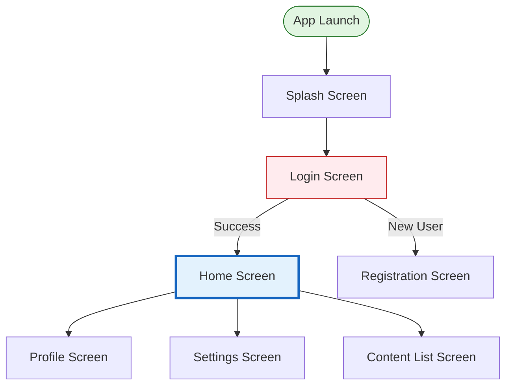

# Generate Screen Flow — Workflow Reference

Generate Screen List (CSV) and Screen Flow Diagram (Mermaid) from project data source.

## Data Provider

All queries use the **configured data provider** (default: `clio_query` MCP tool via Clio Knowledge Graph).
See `SKILL.md` → Data Provider section for setup and configuration.

---

## Purpose

Automatically extract screen/page information from the project data source and generate:
1. **Screen List** — CSV file containing all screens with metadata
2. **Screen Flow Diagram** — Mermaid flowchart showing navigation between screens
3. **Screen Flow Documentation** — Markdown file with full analysis

---

## Execution Workflow

### SEQUENTIAL STEPS (Do NOT run queries in parallel)

---

### Step 0: Check for Project Configuration

**Check for config file in the current directory:**
1. **Look for `.estimate.yml`** — if exists, read and extract `project_id`
2. **If not found, look for `.clio.yml`** — if exists, read and extract `project_id`
3. **If neither exists:** Ask user for `project_id`

---

### Step 1: Extract All Screens

**Query the project data source using the data provider tool (default: `clio_query`):**

```
query: "List all screens, pages, views, UI interfaces, user interfaces, navigation screens, application screens, mobile screens, web pages. Include screen names, screen types, purposes, descriptions, and any screen identifiers."
```

**Expected Output:**
- Screen names (e.g., "Login Screen", "Home Page", "Profile View")
- Screen types (e.g., "Authentication", "Dashboard", "Form", "List")
- Screen descriptions/purposes

**Post-processing:**
- Deduplicate similar screen names
- Normalize screen names
- Assign unique IDs: `SCR001`, `SCR002`, etc.

---

### Step 2: Extract Navigation Relationships

**Query navigation flow between screens:**

```
query: "Navigation flow between screens, screen transitions, routing logic, user journey, how users navigate between screens, screen navigation actions, page routing, screen sequence, navigation graph, navigation paths, screen connections"
```

**Expected Output:**
- Source screen → Target screen relationships
- Navigation triggers (button clicks, links, auto-navigation)
- Navigation conditions

**Post-processing:**
- Build adjacency list
- Identify navigation types: direct, conditional, modal, tab-based

---

### Step 3: Identify Entry & Exit Points

**Query for application entry and exit flows:**

```
query: "Application entry points, first screen, splash screen, landing page, initial screen, app launch screen, exit flows, logout screen, app termination, final screens"
```

**Expected Output:**
- Entry points (Splash, Login, Onboarding)
- Exit points (Logout, Close, Success/Error states)

---

### Step 4: Enrich Screen Details

**For each screen (top 10-15 most important), query detailed context:**

```
query: "Screen: [SCREEN_NAME]. Features, buttons, input fields, actions, navigation options, user interactions, functionality, UI components, form fields, data displayed"
```

**Expected Output:**
- Features on each screen
- Interactive elements (buttons, links, forms)
- Data inputs/outputs
- Navigation options available

---

### Step 5: Analyze & Structure Data

**Process collected data:**

1. **Build Graph Structure:**
   - Nodes: Screens with properties (ID, name, type, description, features)
   - Edges: Navigation relationships with labels (action, condition)

2. **Identify Special Screens:**
   - **Entry Points**: Screens with no incoming edges
   - **Hub Screens**: Screens with many outgoing connections
   - **Dead-end Screens**: Screens with no outgoing edges except back/logout
   - **Critical Path**: Main user journey

3. **Calculate Metrics:**
   - Incoming connections count (popularity)
   - Outgoing connections count (complexity)
   - Navigation depth from entry point
   - Priority score

---

### Step 6: Generate Screen List (CSV)

**CSV Structure:**
```csv
Screen ID,Screen Name,Screen Type,Description,Key Features,Incoming From,Outgoing To,Priority,Notes
SCR001,Splash Screen,Entry,"App loading","Logo, Loading","-","Login (auto)",Critical,
SCR002,Login Screen,Authentication,"User login","Email, Password, Login btn","Splash","Home (success), Register",Critical,
...
```

**Save to:** `outputs/screen_list_{project_id}_{YYYYMMDD_HHMMSS}.csv`

---

### Step 7: Generate Mermaid Flow Diagram

**Create Mermaid flowchart:**



**Styling Guidelines:**
- **Entry Points** (green): Splash, Onboarding
- **Authentication** (red): Login, Register
- **Hub Screens** (blue, bold): Home, Dashboard
- **Form Screens** (purple): Edit, Create, Settings forms
- **Exit Points** (pink): Logout, Close confirmations
- **Decision Points** (diamond shape): `{...}` syntax

**Advanced Features:**
- Use subgraphs for grouping
- Add conditional labels: `-->|condition|`
- Different arrow types: `-->` solid, `-.->` dotted, `==>` thick

---

### Step 8: Create Markdown Documentation

Generate comprehensive markdown with:
- Statistics (total screens, entry/hub/form/dead-end counts)
- Screen List table
- Mermaid diagram
- Navigation Matrix
- Critical Paths
- Screen Details for each screen
- Analysis & Insights (hub screens, dead-ends, potential issues)
- Legend

**Save to:** `outputs/screen_flow_{project_id}_{YYYYMMDD_HHMMSS}.md`

---

### Step 9: Save Files

- **CSV:** `outputs/screen_list_{project_id}_{timestamp}.csv`
- **Markdown:** `outputs/screen_flow_{project_id}_{timestamp}.md`

---

## Final Output

```
Screen Flow Generation Complete!

Statistics:
- Total Screens: [N]
- Navigation Paths: [N]
- Entry Points: [N]
- Hub Screens: [N]

Files Generated:
- outputs/screen_list_{project_id}_{timestamp}.csv
- outputs/screen_flow_{project_id}_{timestamp}.md
```

---

## Edge Cases

- **No screens found:** Try broader query: `"UI components, views, pages, interfaces, user-facing elements"`
- **Navigation unclear:** Try: `"User flow, user journey, workflow, process flow, interaction flow"`
- **Too many screens (>50):** Focus on critical paths, group by module, use subgraphs
- **Circular navigation:** Highlight in diagram with different color, document in issues

---

## Key Constraints

- All screen data must come from the configured data source — **no fabrication**
- If data is unavailable after follow-up queries, **note as unknown**
- Use Edit tool to write files incrementally
- Mermaid diagram must be syntactically valid
