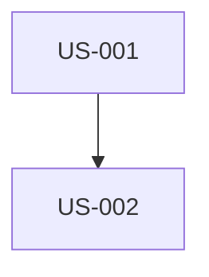

# Generate User Stories — Workflow Reference

Generate comprehensive User Stories from project data source in standard format: As a [role], I want [action], so that [benefit].

## Data Provider

All queries use the **configured data provider** (default: `clio_query` MCP tool via Clio Knowledge Graph).
See `SKILL.md` → Data Provider section for setup and configuration.

---

## Purpose

Generate detailed user stories from the project data source:
1. Query **project data** for project information
2. Group related features into logical user stories
3. Write stories in standard format: "As a [role], I want [action], so that [benefit]"
4. Include acceptance criteria, priority, story points, and dependencies
5. Output to `outputs/user_stories_{project_id}_{timestamp}.md`

**CRITICAL RULES:**
- Do NOT use existing files (CSV, Markdown) — query project data source only
- Do NOT create or execute Python scripts
- Write epics and stories DIRECTLY to the output file using Edit tool
- Generate ONE epic at a time and append to the same file

---

## Workflow

### SEQUENTIAL STEPS (Do NOT run queries in parallel)

---

### Step 0: Check for Project Configuration

**Check for config file in the current directory:**

1. **Look for `.estimate.yml`** — if exists, read and extract `project_id`
2. **If not found, look for `.clio.yml`** — if exists, read and extract `project_id`
3. **If neither exists:** Ask user for `project_id`

---

### Step 1: Query Project Data Source

Perform queries sequentially using the data provider tool (default: `clio_query`):

**Query 1 — User Roles, Personas & Goals**
```
project_id: {project_id}
query: "User roles, personas, user types, actors, stakeholders, admin, customer, guest, user profile, user permissions, user goals, user needs, user objectives, what users want to achieve, user motivations, user expectations, problem to solve"
```
**Extract:** List of all user roles, characteristics, permissions, typical goals, primary user needs, desired outcomes.

---

**Query 2 — Features, Functionalities & Workflows**
```
project_id: {project_id}
query: "Features, functionalities, capabilities, system features, screens, pages, views, user interface, user actions, user tasks, workflows, processes, use cases, CRUD operations, create, read, update, delete, data management, user interactions, user flow, navigation, screen transitions, forms, buttons, actions, events"
```
**Extract:** All system features, screens, user actions, workflows, detailed user interactions, navigation patterns.

---

**Query 3 — Business Value, Benefits & Priorities**
```
project_id: {project_id}
query: "Business value, business benefits, value proposition, why build this feature, ROI, user benefits, business objectives, business outcomes, competitive advantage, feature priority, priority level, must have, should have, could have, MoSCoW, critical features, important features, release phases, MVP, phase 1, phase 2"
```
**Extract:** Why features exist, business justification, user benefits, feature importance, prioritization criteria.

---

**Query 4 — Requirements & Acceptance Criteria**
```
project_id: {project_id}
query: "Acceptance criteria, success criteria, expected behavior, test scenarios, test cases, validation rules, business rules, functional requirements, non-functional requirements, requirements, definition of done, completion criteria, quality criteria"
```
**Extract:** Specific requirements, validation rules, success conditions, testable criteria.

---

**Query 5 — Technical Context & Dependencies**
```
project_id: {project_id}
query: "Technical requirements, system architecture, integrations, APIs, third-party services, dependencies, technical constraints, platforms, technologies, database, authentication, security, performance requirements"
```
**Extract:** Technical dependencies, integrations, constraints, architecture considerations.

---

**Query 6 — Project Context & Domain Knowledge**
```
project_id: {project_id}
query: "Project overview, project description, project goals, business domain, industry, target audience, key features, main functionalities, core capabilities, project scope, project objectives"
```
**Extract:** Overall project context, domain knowledge, project scope, key objectives.

---

### Step 3: Group Features into User Stories

Group related features by:
- User journey (Login, Profile management)
- Feature area (Dashboard, Reports)
- User role (Admin, Customer features)
- Keep CRUD operations together

Story size: 3-8 points per story (split if >13 points)

---

### Step 4: Write Output File Incrementally

**IMPORTANT:** Write DIRECTLY to `outputs/user_stories_{project_id}_{timestamp}.md` using Edit tool.

**Process:**
1. **First:** Create file with header, summary, and user roles
2. **Then:** For EACH epic, append directly to file
3. **Finally:** Append appendices and update statistics

---

### Step 5: Story Format

```markdown
### US-[ID]: [Story Title]

**As a** [user role],
**I want** [action/capability],
**So that** [business value/benefit].

**Priority:** [Critical/High/Medium/Low]
**Story Points:** [1/2/3/5/8/13]

**Acceptance Criteria:**
- [ ] Given [context], when [action], then [outcome]
- [ ] Given [context], when [action], then [outcome]

**Technical Notes:** [Dependencies, integrations, constraints]

**Dependencies:** [Other story IDs if any]

---
```

**Priority Levels:**
- **Critical:** Must-have for release, blocking
- **High:** Important, significant value
- **Medium:** Valuable but not essential
- **Low:** Nice-to-have, can defer

**Story Points:**
- **1:** 1-2h (simple UI change)
- **2:** 2-4h (basic form)
- **3:** 4-8h (CRUD screen)
- **5:** 8-16h (complex form, API integration)
- **8:** 16-24h (multi-step workflow)
- **13:** 24-40h (major feature, consider splitting)

---

### Step 6: File Structure

```markdown
# User Stories - [Project Name]
**Project ID:** {project_id}
**Generated:** {timestamp}

## Executive Summary
[Brief project description]

**Statistics:**
- Total Stories: [N]
- Total Story Points: [N]
- By Priority: Critical ([N]), High ([N]), Medium ([N]), Low ([N])

## User Roles & Personas
[List identified roles with descriptions and goals]

## Epic 1: [Epic Name]
**Description:** [Epic description]
**Business Value:** [Why this matters]
**Stories:** [N] | **Points:** [N]

### US-001: [Story Title]
[Full story following format from Step 5]

...

## Appendix

### A. Dependencies Graph


### B. Traceability Matrix
| Story ID | Title | Priority | Points | Epic |
|----------|-------|----------|--------|------|

### C. Release Planning
**Phase 1 - MVP:** [Critical + High stories]
**Phase 2 - Enhancement:** [Medium stories]
**Phase 3 - Future:** [Low stories]
```

---

## Implementation Instructions

1. **Query project data source** sequentially for all required information
2. **Create output file** with header and user roles section
3. **For each epic:**
   - Write epic header directly to file using Edit tool
   - Write all user stories for that epic directly to file
   - Do NOT generate Python scripts
4. **Append appendices** at the end
5. **Update summary** with final statistics

---

## Final Summary

After completing all parts:

```
User Stories Generated

Summary:
- Total Stories: [N] ([N] points)
- By Priority: Critical ([N]), High ([N]), Medium ([N]), Low ([N])

Epics: [List with story counts]

File: outputs/user_stories_{project_id}_{timestamp}.md
```
