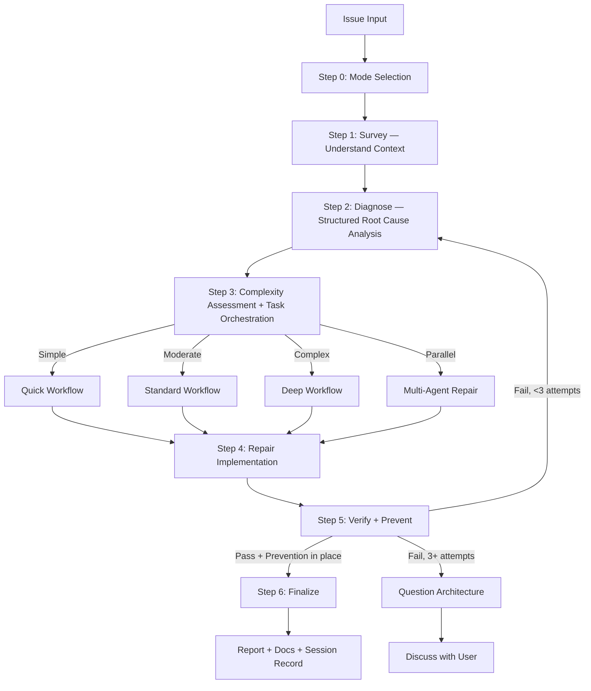

# Repairing the Defect

A defect that is patched at the surface will return through the same crack.
The craftsman's repair begins not with tools, but with understanding —
tracing the flaw to its origin before touching anything.

## Arguments

- `--auto` — Autonomous mode (**default**)
- `--review` — Human-in-the-loop review mode
- `--quick` — Quick mode for trivial issues
- `--parallel` — Route to parallel `implementer` agents per issue

## The Repair Law

No fix is proposed before completing the Survey (Step 1) and Diagnosis (Step 2).
Symptom repairs are failures in disguise. Find the origin first through structured analysis.
Guessing is not diagnosis.

If 3 or more repair attempts fail, **stop**. Question the architecture. Discuss with the user before attempting further.

*Exception:* `--quick` mode allows a fast survey→diagnose→fix cycle for trivial issues (lint, type errors).
*User override:* If the user explicitly instructs a specific fix, honor their instruction.

## The Craftsman's Discipline

*"Seeing the symptom is not understanding the cause."*
— Survey the affected area before forming any hypothesis.

*"There is no such thing as a temporary fix."*
— Patch it properly now, or patch it again later under worse conditions.

*"Changing X to see what happens is not diagnosis."*
— Random changes waste time and introduce new flaws. Use structured investigation.

*"Probably X" means nothing."*
— "Probably" is a guess. Verify the hypothesis against evidence before acting.

*"Three failed attempts mean the approach is wrong."*
— After 3 failures, stop and reconsider the architecture. More attempts compound the problem.

*"Emergency is not an excuse to skip the process."*
— Structured diagnosis is faster than guess-and-check. The process is the shortcut.

*"Knowing the codebase is not the same as reading it."*
— Survey to verify assumptions before acting. Knowledge decays; the code does not lie.

*"Tests passing is not the same as the defect being gone."*
— Without prevention, the same class of defect will return. Add guards.

## Process Flow (Authoritative)



**This diagram is the authoritative workflow.** If prose conflicts with this flow, follow the diagram.

## Workflow

### Step 0: Mode Selection

**First action:** If there is no "auto" keyword in the request, use `AskUserQuestion` to determine workflow mode:

| Option | Recommend When | Behavior |
|--------|----------------|----------|
| **Autonomous** (default) | Simple/moderate issues | Auto-approve if score ≥ 9.5 & 0 critical |
| **Human-in-the-loop** | Critical/production code | Pause for approval at each step |
| **Quick** | Type errors, lint, trivial bugs | Fast survey → diagnose → repair cycle |

See `references/mode-selection.md` for AskUserQuestion format.

### Step 1: Survey (MANDATORY — never skip)

**Purpose:** Understand the affected codebase BEFORE forming any hypotheses.

**Required actions:**
1. Activate `tkm:scan-codebase` skill OR launch 2–3 parallel `Explore` subagents
2. Discover: affected files, dependencies, related tests, recent changes (`git log`)
3. Read `./docs` for project context if unfamiliar

**Quick mode:** Minimal survey — locate affected file(s) and direct dependencies only.
**Standard/Deep mode:** Full survey — map module boundaries, test coverage, call chains.

**Output:** `⚒ Step 1: Surveyed — [N] files mapped, [M] dependencies, [K] tests found`

### Step 2: Diagnose (MANDATORY — never skip)

**Purpose:** Structured root cause analysis. No guessing. Evidence-based only.

**Required actions:**
1. **Capture pre-repair state:** Record exact error messages, failing test output, stack traces, log snippets. This becomes the baseline for Step 5 verification.
2. Activate `tkm:debug-code` skill (systematic-debugging + root-cause-tracing techniques)
3. Activate `tkm:think-sequential` skill — form hypotheses through structured reasoning, not guessing
4. Spawn parallel `Explore` subagents to test each hypothesis against codebase evidence
5. If 2+ hypotheses fail → auto-activate `tkm:solve-problem` skill for alternative approaches
6. Produce diagnosis report: confirmed root cause, evidence chain, affected scope

See `references/diagnosis-protocol.md` for full methodology.

**Output:** `⚒ Step 2: Diagnosed — Root cause: [summary], Evidence: [brief], Scope: [N files]`

### Step 3: Complexity Assessment & Task Orchestration

Classify before routing. See `references/complexity-assessment.md`.

| Level | Indicators | Workflow |
|-------|------------|----------|
| **Simple** | Single file, clear error, type/lint | `references/workflow-quick.md` |
| **Moderate** | Multi-file, root cause unclear | `references/workflow-standard.md` |
| **Complex** | System-wide, architecture impact | `references/workflow-deep.md` |
| **Parallel** | 2+ independent issues OR `--parallel` flag | Parallel `implementer` agents |

**Task Orchestration (Moderate+ only):** After classifying, create native Claude Tasks for all phases upfront with dependencies. See `references/task-orchestration.md`.
- Skip for Quick workflow (< 3 steps, overhead exceeds benefit)
- Use `TaskCreate` with `addBlockedBy` for dependency chains
- Update via `TaskUpdate` as each phase completes
- For Parallel: create separate task trees per independent issue
- **Fallback:** Task tools are CLI-only — unavailable in VSCode extension. If they error, use `TodoWrite`. Repair workflow remains fully functional without them.

### Step 4: Repair Implementation

- Implement the repair per selected workflow, updating Tasks as phases complete
- Follow the diagnosis findings — repair the ROOT CAUSE, not symptoms
- Minimal changes only. Follow existing patterns.

### Step 5: Verify + Prevent (MANDATORY — never skip)

**Purpose:** Prove the repair holds AND prevent the same defect class from returning.

**Required actions:**
1. **Verify (iron law):** Run the EXACT commands from the pre-repair state capture. Compare output. No claims without fresh evidence.
2. **Regression test:** Add or update test(s) that specifically cover the repaired issue. The test MUST fail without the repair and pass with it.
3. **Prevention gate:** Apply defense-in-depth validation where applicable. See `references/prevention-gate.md`.
4. **Parallel verification:** Launch `Bash` agents for typecheck + lint + build + test.

**If verification fails:** Loop back to Step 2 (re-diagnose). After 3 failures → question architecture, discuss with user.

See `references/prevention-gate.md` for prevention requirements.

**Output:** `⚒ Step 5: Verified + Prevented — [before/after], [N] tests added, [M] guards added`

### Step 6: Finalize (MANDATORY — never skip)

1. Report summary: confidence score, root cause, changes, files, prevention measures
2. `doc-writer` subagent → update `./docs` if changes warrant (NON-OPTIONAL)
3. `TaskUpdate` → mark ALL Claude Tasks `completed` (skip if Task tools unavailable)
4. Ask user if they want to commit via `git-manager` subagent
5. Run `/tkm:write-journal` to write a concise session record upon completion

---

## Skill/Subagent Activation Matrix

See `references/skill-activation-matrix.md` for the complete matrix.

**Always activate (ALL workflows):**
- `tkm:scan-codebase` (Step 1) — survey before diagnosing
- `tkm:debug-code` (Step 2) — systematic root cause investigation
- `tkm:think-sequential` (Step 2) — structured hypothesis formation

**Conditional:**
- `tkm:solve-problem` — auto-triggers when 2+ hypotheses fail in Step 2
- `tkm:optimize-context` — when repairing AI/LLM/agent code
- `tkm:manage-project` — moderate+ for task hydration/sync-back

**Subagents:** `debugger`, `researcher`, `planner`, `reviewer`, `tester`, `Bash`
**Parallel:** Multiple `Explore` agents for surveying, `Bash` agents for verification

## Output Format

```
⚒ Step 0: [Mode] selected
⚒ Step 1: Surveyed — [N] files, [M] deps
⚒ Step 2: Diagnosed — Root cause: [summary]
⚒ Step 3: [Complexity] detected — [workflow] selected
⚒ Step 4: Repaired — [N] files changed
⚒ Step 5: Verified + Prevented — [tests added], [guards added]
⚒ Step 6: Complete — [action taken]
```

## References

Load as needed:
- `references/mode-selection.md` — AskUserQuestion format for mode
- `references/diagnosis-protocol.md` — Structured diagnosis methodology
- `references/prevention-gate.md` — Prevention requirements after repair
- `references/complexity-assessment.md` — Classification criteria
- `references/task-orchestration.md` — Native Claude Task patterns for moderate+ workflows
- `references/workflow-quick.md` — Quick: survey → diagnose → repair → verify+prevent → review
- `references/workflow-standard.md` — Standard: full pipeline with Tasks
- `references/workflow-deep.md` — Deep: research + consultation + plan with Tasks
- `references/review-cycle.md` — Review logic (autonomous vs human-in-the-loop)
- `references/skill-activation-matrix.md` — When to activate each skill
- `references/parallel-exploration.md` — Parallel Explore/Bash/Task coordination patterns

**Specialized Workflows:**
- `references/workflow-ci.md` — GitHub Actions/CI failures
- `references/workflow-logs.md` — Application log analysis
- `references/workflow-test.md` — Test suite failures
- `references/workflow-types.md` — TypeScript type errors
- `references/workflow-ui.md` — Visual/UI issues (requires design skills)
