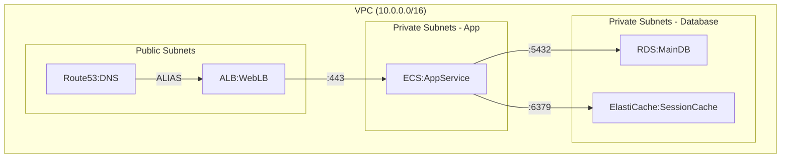

# Mermaid to Terraform Mapping Reference

Practical guide for converting Mermaid architecture diagrams to Terraform resource definitions.

## Node Naming Convention

All nodes in architecture diagrams follow the `[ServiceType:Name]` format:

```
EC2:WebServer           # AWS EC2 instance
RDS:MainDB             # AWS RDS database
S3:Assets              # AWS S3 bucket
ALB:PublicLB           # AWS Application Load Balancer
ECS:AppService         # AWS ECS service
Lambda:Processor       # AWS Lambda function
SQS:TaskQueue          # AWS SQS queue
CloudFront:CDN         # AWS CloudFront distribution
Route53:DNS            # AWS Route53 DNS
EKS:KubeCluster        # AWS EKS cluster
DynamoDB:SessionStore  # AWS DynamoDB table
ElastiCache:Cache      # AWS ElastiCache cluster
```

## Node-to-Resource Mapping

| Node Prefix | Terraform Resources | Key Attributes |
|---|---|---|
| **VPC** | `aws_vpc`, `aws_subnet`, `aws_internet_gateway`, `aws_nat_gateway` | `cidr_block`, `availability_zone`, `map_public_ip_on_launch` |
| **EC2** | `aws_instance`, `aws_launch_template`, `aws_security_group` | `instance_type`, `ami`, `subnet_id`, `key_name` |
| **RDS** | `aws_db_instance`, `aws_db_subnet_group`, `aws_db_security_group` | `engine`, `instance_class`, `allocated_storage`, `username` |
| **ECS** | `aws_ecs_cluster`, `aws_ecs_service`, `aws_ecs_task_definition`, `aws_ecr_repository` | `launch_type` (FARGATE), `cpu`, `memory`, `container_definitions` |
| **ALB** | `aws_lb`, `aws_lb_target_group`, `aws_lb_listener`, `aws_lb_listener_rule` | `load_balancer_type` (application), `protocol`, `port` |
| **NLB** | `aws_lb`, `aws_lb_target_group`, `aws_lb_listener` | `load_balancer_type` (network), `protocol` (TCP/UDP) |
| **S3** | `aws_s3_bucket`, `aws_s3_bucket_versioning`, `aws_s3_bucket_encryption`, `aws_s3_bucket_public_access_block` | `bucket`, `versioning`, `server_side_encryption_configuration` |
| **Lambda** | `aws_lambda_function`, `aws_iam_role`, `aws_lambda_permission` | `filename`/`image_uri`, `runtime`, `handler`, `timeout` |
| **CloudFront** | `aws_cloudfront_distribution`, `aws_cloudfront_origin_access_identity` | `origin` (S3/ALB), `default_cache_behavior`, `viewer_protocol_policy` |
| **SQS** | `aws_sqs_queue` | `visibility_timeout`, `message_retention_seconds`, `delay_seconds` |
| **SNS** | `aws_sns_topic`, `aws_sns_topic_subscription` | `name`, `protocol`, `endpoint` |
| **Route53** | `aws_route53_zone`, `aws_route53_record` | `type` (A/CNAME/ALIAS), `name`, `ttl`/`alias` |
| **EKS** | `aws_eks_cluster`, `aws_eks_node_group`, `aws_launch_template` | `version`, `endpoint_private_access`, `node_role_arn` |
| **DynamoDB** | `aws_dynamodb_table`, `aws_dynamodb_global_table` | `hash_key`, `range_key`, `billing_mode`, `stream_specification` |
| **ElastiCache** | `aws_elasticache_cluster`, `aws_elasticache_parameter_group`, `aws_elasticache_subnet_group` | `engine` (redis/memcached), `node_type`, `num_cache_nodes` |
| **SecretsManager** | `aws_secretsmanager_secret`, `aws_secretsmanager_secret_version` | `name`, `secret_string`, `recovery_window_in_days` |
| **IAM** | `aws_iam_role`, `aws_iam_policy`, `aws_iam_role_policy_attachment` | `assume_role_policy`, `policy`, `inline_policy` |

## Edge-to-Dependency Mapping

Arrow types define resource relationships and security rules:

| Arrow Type | Symbol | Terraform Implementation |
|---|---|---|
| **Solid** (data flow) | `-->` | `aws_security_group_rule` (ingress), `aws_iam_policy` (inline or attached) |
| **Dotted** (async/optional) | `-.->` | `aws_sqs_queue`, `aws_sns_topic` between nodes |
| **Thick** (primary traffic) | `==>` | Primary ALB/NLB route, `target_group_attachment` |

Arrow labels specify ports/protocols:
- `-->|:443|` → HTTPS (port 443)
- `-->|:5432|` → PostgreSQL (port 5432)
- `-->|:6379|` → Redis (port 6379)
- `-->|SQS|` → Queue-based async pattern

## Subgraph-to-VPC Mapping

Subgraph boundaries define network and placement topology:

| Subgraph | Terraform Resources | Configuration |
|---|---|---|
| `subgraph VPC` | `aws_vpc`, nested subnets | `cidr_block`, `enable_dns_hostnames=true` |
| `subgraph Public` | `aws_subnet` | `map_public_ip_on_launch=true`, IGW route table |
| `subgraph Private` | `aws_subnet` | `map_public_ip_on_launch=false`, NAT gateway route table |
| `subgraph AZ-a` / `AZ-b` | Subnet placement | `availability_zone` = specific AZ |
| Nested subgraphs | VPC → Subnets → AZs | Hierarchy defines resource placement |

### Subnet Configuration Rules

- **Public Subnet**: Must have `aws_route_table` with `0.0.0.0/0` → `aws_internet_gateway`
- **Private Subnet**: Must have `aws_route_table` with `0.0.0.0/0` → `aws_nat_gateway` (in public subnet)
- **Multi-AZ**: Create subnets in minimum 2 AZs for HA

## Multi-Environment Generation

Single Mermaid diagram generates three environment directories with scaling/config variations:

```
envs/
├── dev/
│   └── main.tf          # Single AZ, smaller instances, minimal resources
├── staging/
│   └── main.tf          # Multi-AZ, matches prod config, reduced replica count
└── prod/
    └── main.tf          # Full HA, multi-AZ, enhanced monitoring
```

### Environment-Specific Overrides

**Dev Environment:**
- Single AZ
- Instance types: `t3.micro` / `t3.small`
- RDS: single-az, no multi-AZ failover
- DynamoDB: on-demand billing mode
- No redundancy (single replica)

**Staging Environment:**
- Multi-AZ (2 AZs)
- Instance types: match prod (e.g., `t3.medium`)
- RDS: multi-AZ enabled
- DynamoDB: provisioned billing mode (reduced capacity)
- Replicas: 1x prod count

**Prod Environment:**
- Multi-AZ (3+ AZs)
- Instance types: optimized (e.g., `m5.large`, `c5.xlarge`)
- RDS: multi-AZ + read replicas
- DynamoDB: global tables + point-in-time recovery
- Enhanced monitoring, auto-scaling policies, backup retention

## Worked Example: 3-Tier Web Application

### Input Mermaid Diagram



### Output Terraform Structure

```
main.tf                                   # VPC, subnets, route tables, NAT
security-groups.tf                        # Security group rules
load-balancer.tf                          # ALB, target groups, listeners
ecs.tf                                    # ECS cluster, task definition, service
rds.tf                                    # RDS instance, subnet group
elasticache.tf                            # ElastiCache cluster, parameter group
route53.tf                                # Route53 zone, DNS records
iam.tf                                    # Execution roles, task roles
outputs.tf                                # DNS names, endpoints
variables.tf                              # Environment-specific configs
```

### Key Resource Mappings

**Route53 → ALB:**
```hcl
resource "aws_route53_record" "web_app" {
  zone_id = aws_route53_zone.main.zone_id
  name    = "app.example.com"
  type    = "A"
  alias {
    name                   = aws_lb.web_lb.dns_name
    zone_id                = aws_lb.web_lb.zone_id
    evaluate_target_health = true
  }
}
```

**ALB → ECS:**
```hcl
resource "aws_security_group_rule" "alb_to_ecs" {
  type                     = "ingress"
  from_port                = 443
  to_port                  = 443
  protocol                 = "tcp"
  source_security_group_id = aws_security_group.alb.id
  security_group_id        = aws_security_group.ecs.id
}
```

**ECS → RDS:**
```hcl
resource "aws_security_group_rule" "ecs_to_rds" {
  type                     = "ingress"
  from_port                = 5432
  to_port                  = 5432
  protocol                 = "tcp"
  source_security_group_id = aws_security_group.ecs.id
  security_group_id        = aws_security_group.rds.id
}
```

**ECS → ElastiCache:**
```hcl
resource "aws_security_group_rule" "ecs_to_cache" {
  type                     = "ingress"
  from_port                = 6379
  to_port                  = 6379
  protocol                 = "tcp"
  source_security_group_id = aws_security_group.ecs.id
  security_group_id        = aws_security_group.elasticache.id
}
```

## Validation Checklist

When converting Mermaid to Terraform:

- [ ] All nodes have unique resource names (no duplicates across environments)
- [ ] All solid arrows have corresponding security group rules
- [ ] All subgraph hierarchies map to VPC → subnets → AZs
- [ ] Route tables exist for each subnet (public/private)
- [ ] NAT gateways exist for private subnets egress
- [ ] IAM roles attached to compute resources (ECS, Lambda, EC2)
- [ ] RDS uses subnet groups (multi-AZ if prod)
- [ ] ElastiCache uses subnet groups and parameter groups
- [ ] Load balancers in public subnets, targets in private
- [ ] Route53 records point to appropriate endpoints (ALB/CloudFront/IPs)
- [ ] Environment-specific variable overrides for instance types, counts
- [ ] Backup/retention policies for databases
- [ ] Tags applied consistently across all resources

## Common Patterns

### Pattern: Database Behind Private Subnet
```
ALB → ECS → RDS (via private subnet, security group rule on RDS)
```
Requires: NAT gateway in public subnet, security group ingress on RDS from ECS SG.

### Pattern: Async Processing with Queue
```
ECS -.-> SQS -.-> Lambda (dotted arrows = async)
```
Requires: `aws_sqs_queue`, Lambda permission to read queue, SQS event source mapping.

### Pattern: CDN Distribution
```
CloudFront → S3 or ALB (origin)
```
Requires: `aws_cloudfront_origin_access_identity` for S3, or ALB in public subnet.

### Pattern: Multi-AZ Resilience
```
subgraph AZ-a [ EC2, RDS primary ]
subgraph AZ-b [ EC2, RDS replica ]
```
Requires: Subnets in both AZs, RDS multi-AZ enabled, ALB targets in both AZs.
