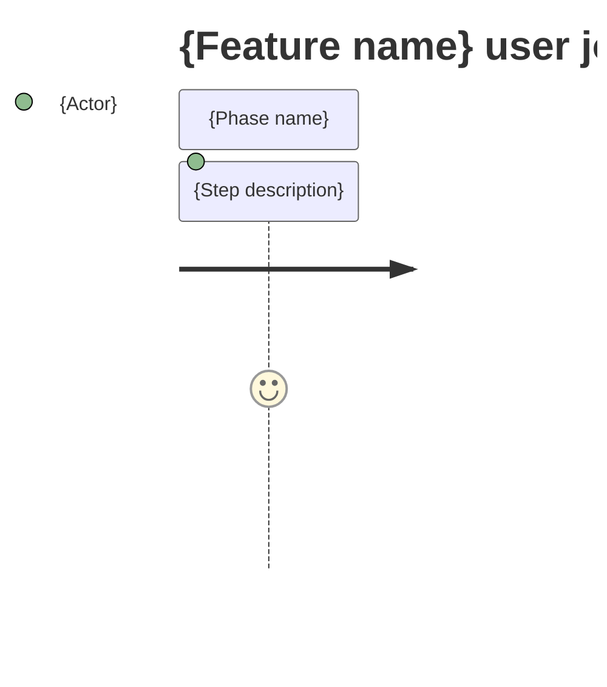
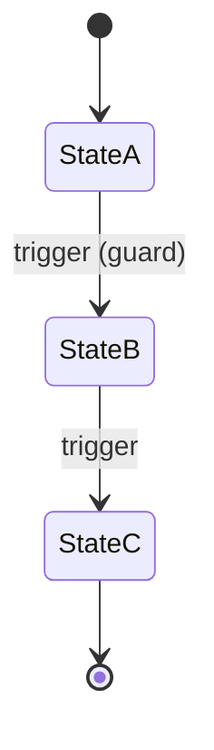

<!-- Contract: references/feature-spec-researcher-contract.md -->

# Feature Specification: {F###_NAME}

**Priority**: {P0|P1|P2|P3}
**Type**: {ui|background|mixed}
**Generated**: {DATE}

## Overview

{2–3 sentence narrative: what the feature does, who uses it, what triggers it, which subsystems it touches.}

## Why This Exists

{1–2 sentences on business rationale — user problem solved, product value, or compliance driver.}

{If code provides no signal for rationale, write exactly:
`N/A — inferred from code; domain confirmation needed.`}

## Who Uses It

- **{Persona / role}** — {what they do with this feature} ({PERM###_CODE} if applicable)
- **{Persona 2}** — {what they do with this feature}

## Business Workflow

```
1. {Actor} {action} → {specific table/entity/field affected}
2. {Actor} {action} → {dispatches Job/Event class name} → {effect}
3. {Condition check} → {specific guard/validation from controller}
4. {Final state change} → {table.column = value}
```

{Numbered steps are MANDATORY. Each step MUST reference specific entities, tables,
job classes, or field names from source code. Generic prose without specifics is rejected.
Minimum 3 steps for non-trivial features.}

## Screen Flow

**See:** ScreenFlow § {F###_entry}

{For UI and mixed features, a Screen Route Table is MANDATORY:}

| Screen | Route | Purpose |
|--------|-------|---------|
| {SCR###_Name} | `{/route/path}` | {What user does here} |
| {SCR###_Name (composite)} | `{/route/path/:id}` | {N-tab/region detail} |
| {SCR###/REG001} | {Tab/Region name} | {Region purpose} |

{Optional inline Mermaid journey when the feature spans multiple screens:}



{For background-only features with no UI, write instead:
`N/A — background feature; no user-facing screen flow.`}

## Cross-Cutting Logic

{Use for FR/BR/SM/ALG/INT/SC that apply to ≥2 USs equally OR are system-wide invariants.
When in doubt, place inline under the primary US instead.}

### Requirements

| Code | Description | Endpoint/Handler | Verifiable |
|------|-------------|------------------|------------|
| FR-0XX | {DESCRIPTION — cross-cutting FRs only} | {METHOD} {PATH} | yes |

### Business Rules

None.

### State Machines

None.

### Algorithms

None.

### External Integrations

None.

### Verification

- **SC-0XX** — {global pass/fail condition} (covers FR-0XX)

## User Stories

### {US001_CODE} — {US001_TITLE} (Priority: P1)

**What happens:** {Narrative — who does what, under what conditions, to achieve what outcome.}
**Why this priority:** {Value + urgency rationale. Why P1 and not P2?}
**Independent Test:** {How this story can be validated alone — specific action + observable result.}

**Acceptance Scenarios:**

1. **Given** {initial state}, **When** {action}, **Then** {expected outcome}.
2. **Given** {initial state}, **When** {action}, **Then** {expected outcome}.

**Requirements fulfilled:**
- **FR-001** {DESCRIPTION} — `{METHOD} {PATH}` via `{Handler::method}`
- **FR-002** {DESCRIPTION} — `{METHOD} {PATH}` via `{Handler::method}`

**Rules enforced:**

### BR-001_{NameSlug}
**Source:** `{file}:{start}-{end}`
**Applies to:** {endpoint / event / entity}
**Rule:** {What must hold, when enforced, why it exists.}

**Pseudocode:**
```text
# ≤20 lines capturing the check intent
```

**State transitions:**

### SM-001_{EntityLifecycleSlug}
**Source:** `{file}:{start}-{end}`
**States:** {State1, State2, State3}



**Transition rules:**
- `StateA → StateB`: guard = {condition}; side effects = {effect}
- `StateB → StateC`: guard = {condition}; side effects = {effect}

**Algorithms:**

### ALG-001_{AlgorithmNameSlug}
**Source:** `{file}:{start}-{end}`
**Input:** {shape summary}
**Output:** {shape summary}
**Complexity:** {O(n) — or `N/A` if trivial}
**Description:** {What it computes, why, invariants it preserves.}

**Pseudocode:**
```text
# ≤20 lines
```

**External integrations:**

### INT-001_{IntegrationNameSlug}
**Source:** `{file}:{start}-{end}`
**Type:** {api-call | event-publish | webhook-emit | queue-job | notification}
**Target:** {service / topic / queue / endpoint}
**Trigger:** {when invoked}
**Payload:** {fields sent, excluding secrets}
**Failure handling:** {retry policy / DLQ / ignore / compensating action}

**Pseudocode:**
```text
# ≤20 lines
```

**Verification:**
- **SC-001** {pass/fail observable condition} (covers FR-001, BR-001)
- **SC-002** {pass/fail observable condition} (covers FR-002, SM-001)

---

### {US002_CODE} — {US002_TITLE} (Priority: P2)

**What happens:** {Narrative.}
**Why this priority:** {Rationale.}
**Independent Test:** {Validation approach.}

**Acceptance Scenarios:**

1. **Given** {state}, **When** {action}, **Then** {outcome}.

**Requirements fulfilled:**
- **FR-003** {DESCRIPTION} — `{METHOD} {PATH}` via `{Handler::method}`

**Rules enforced:** BR-001 (see US001) — {additional note on how it applies here, if any}

**State transitions:** SM-001 (see US001) — additional transition {StateX → StateY on specific trigger}

**Verification:**
- **SC-003** {pass/fail observable condition} (covers FR-003, SM-001)

---

### Edge Cases

{MANDATORY — minimum 3 rows for UI features, 1 for background features.
Each row must specify scenario, system behavior, and HTTP status/error message.}

| Scenario | Behavior |
|----------|----------|
| {boundary condition / invalid input} | HTTP {4xx}: "{error message from controller}" |
| {concurrent operation / race condition} | {specific system behavior — queue, lock, reject} |
| {missing prerequisite / empty state} | {fallback behavior or error response} |

## Key Entities

{MANDATORY — list ALL database tables this feature reads or writes.
Include table name (not just model code), key columns, and purpose.
Minimum 3 entities for non-trivial features.}

| Entity | Table | Key Columns | Purpose |
|--------|-------|-------------|---------|
| {ModelName} | `{table_name}` | {col1, col2, col3} | {what this feature does with it} |
| {ModelName2} | `{table_name_2}` | {col1, col2} | {read/write purpose} |

## Related Artifacts

- **Screens** (from ScreenList): {SCR###_Name | SCR###/REG###_Name}
  - Example: `SCR001/REG001_UserPanel` (feature owns this region only; parent SCR must also exist)
- **User Stories** (from UserStories): {US###_CODE_LIST}
- **Routes** (from RouteList): {ROUTE###_LIST}
- **Data Models** (from DataModel): {MODEL###_LIST}
- **Background Logic** (from BackgroundLogic): {BL###_CODE_LIST}
- **Permissions** (from Permissions): {PERM###_CODE_LIST}

**Rule:** Every code listed MUST exist in its source artifact. Orphan refs = reviewer critical.

## Spec Documents

{Check upstream spec artifacts that contain codes referenced by this feature.
Include specific codes for quick lookup. Always check System Overview and Feature List.}

- [x] [System Overview](docs/specs/system-overview.md)
- [ ] [Route List](docs/specs/route-list.md) — {ROUTE### codes}
- [ ] [Data Model](docs/specs/data-model.md) — {MODEL### codes}
- [ ] [Screen List](docs/specs/screen-list.md) — {SCR###, SCR###/REG### codes}
- [ ] [Screen Flow](docs/specs/screen-flow.md)
- [ ] [Background Logic](docs/specs/background-logic.md) — {BL### codes}
- [ ] [Permissions](docs/specs/permissions.md) — {PERM### codes}
- [ ] [User Stories](docs/specs/user-stories.md) — {US### codes}
- [x] [Feature List](docs/specs/feature-list.md) — {F###_CODE}

## Assumptions

{MANDATORY — minimum 2 entries for non-trivial features.
Document implicit behaviors, missing DB constraints, eval assumptions, etc.}

- {ASSUMPTION_1 — e.g., "short_name uniqueness enforced at app level, not DB constraint"}
- {ASSUMPTION_2 — e.g., "default value assumed true on create unless set otherwise"}

## Source Code References

{MANDATORY — minimum 3 entries. List primary controllers, models, jobs, services, Vue/page files.
Only include files verified via Grep/Read. DO NOT fabricate paths.}

| Symbol | Path | Purpose |
|--------|------|---------|
| {ControllerName} | `{api/app/Http/Controllers/...}:{line-range}` | {CRUD + guards} |
| {ModelName} | `{api/app/Models/...}:{line-range}` | {entity definition + relations} |
| {JobName} | `{api/app/Jobs/...}` | {background processing} |
| {PageComponent} | `{web/src/pages/...}` | {frontend view} |

## Unresolved Questions

{MANDATORY for complex features (≥1 entry). List anything you could NOT verify from source code,
ambiguous behaviors, undocumented edge cases, or unclear relationships.}

1. **{Topic}**: {Specific question about implementation detail not confirmed from source}
2. **{Topic}**: {Another unresolved question}
