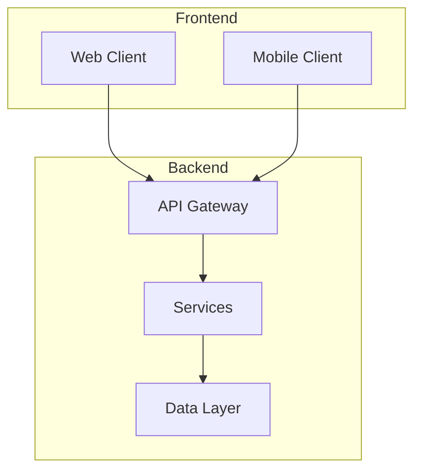
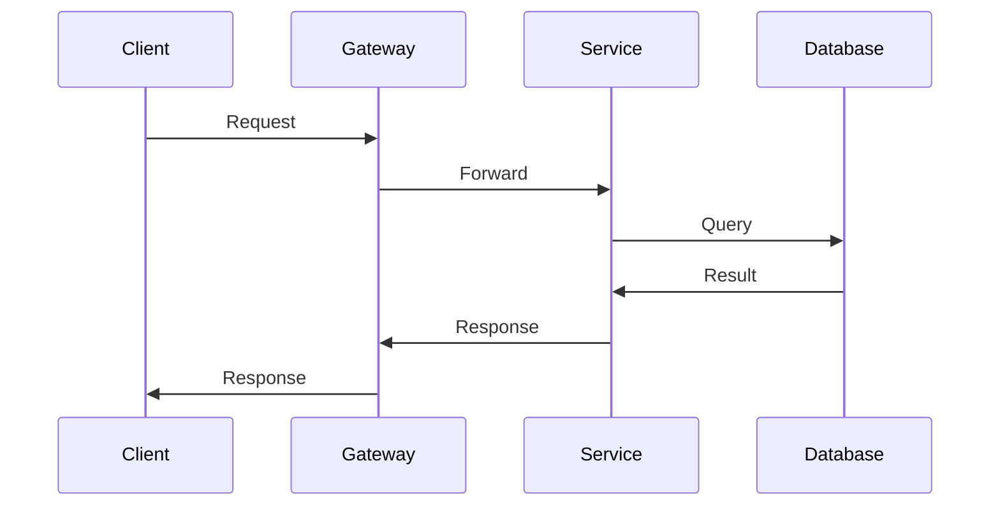

# System Overview

<!--
Wave 9 promotion behavior is defined OUT-OF-BAND, not in this template body:
  - Stub literal + overwrite rule → claude/skills/_shared/docs-canonical-mapping.md § Stub Rule
  - Wave 9 TaskCreate description → claude/skills/rebuild-spec/references/pipeline.md
Wave 1 researcher: do NOT copy this HTML comment into the draft artifact. Begin
the draft with the "Project" line below.
-->

**Project**: {PROJECT_NAME}
**Generated**: {DATE}
**Architecture Type**: {ARCHITECTURE_TYPE}

## Executive Summary

{DESCRIPTION}

## System Architecture

### High-Level Architecture

### Technology Stack

| Layer | Technology | Version |
|-------|------------|---------|
| Frontend | {FRONTEND_TECH} | {VERSION} |
| Backend | {BACKEND_TECH} | {VERSION} |
| Database | {DB_TYPE} | {VERSION} |
| Cache | {CACHE_TYPE} | {VERSION} |
| Queue | {QUEUE_TYPE} | {VERSION} |

## Data Flow

## Key Design Decisions

### Decision 1: {TITLE}

**Context**: {CONTEXT}

**Decision**: {DECISION}

**Rationale**: {RATIONALE}

### Decision 2: {TITLE}

**Context**: {CONTEXT}

**Decision**: {DECISION}

**Rationale**: {RATIONALE}

## Security Overview

- **Authentication**: {AUTH_METHOD}
- **Authorization**: {AUTHZ_METHOD}
- **Data Encryption**: {ENCRYPTION}
- **API Security**: {API_SECURITY}

## Scalability

- **Current Capacity**: {CAPACITY}
- **Scaling Strategy**: {STRATEGY}
- **Performance Targets**: {TARGETS}
